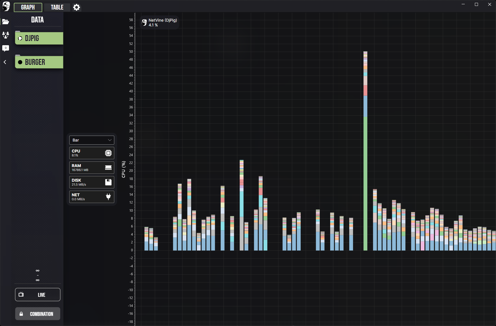
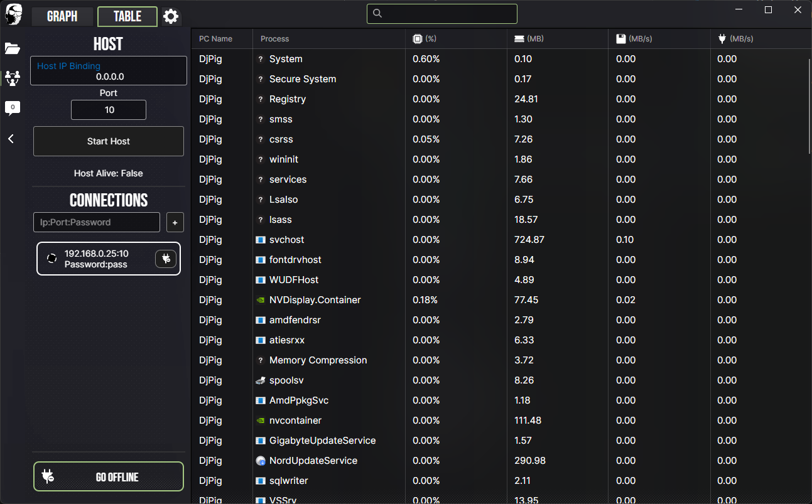

<h1>
  
  Net-Vine
</h1>

Born from the desire to easily profile applications over long periods of time, NetVine is a networked process monitor used to track and manipulate running programs across multiple machines. Review per-process statistics both live and historically, get notifications about programs exceeding thresholds and write rest API scripts to create actions based on collected data.

    

    

## Details

- Adjust live and historical poll rates to suit your needs
- Filter applications by user and use boolean operations to slim your search
- Get toast notifications about programs exceeding user-defined thresholds
- Run Python scripts or web servers to interface with collected data
- Monitor and manage programs on external machines
- Visualize Line, Bar and Pie charts of live or historic data
- Close programs on permitted external machines

> The DB and Scripts folder can be found within `AppData\Roaming\NetVine` in case you want to fully utilize this application.

## Download

Currently only runs on windows.

[TODO: Put executable download link here]